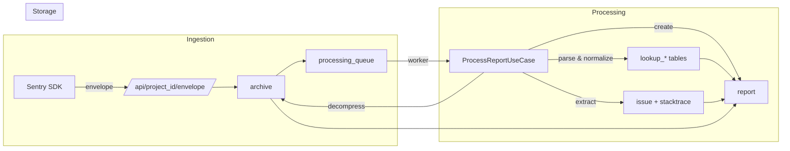

# Database Schema

## Entity Relationship Diagram

```mermaid
erDiagram
    %% ============================================
    %% CORE TABLES
    %% ============================================
    
    project {
        INTEGER id PK
        TEXT public_key UK
        TEXT name
        TIMESTAMP created_at
    }
    
    archive {
        TEXT hash PK
        BLOB compressed_payload
        INTEGER original_size
        TIMESTAMP created_at
    }
    
    processing_queue {
        INTEGER id PK
        TEXT archive_hash FK,UK
        TIMESTAMP created_at
        INTEGER retry_count
        TEXT last_error
        TIMESTAMP next_retry_at
    }
    
    %% ============================================
    %% LOOKUP TABLES
    %% ============================================
    
    lookup_platform {
        INTEGER id PK
        TEXT value UK
    }
    
    lookup_environment {
        INTEGER id PK
        TEXT value UK
    }
    
    lookup_os_name {
        INTEGER id PK
        TEXT value UK
    }
    
    lookup_os_version {
        INTEGER id PK
        TEXT value UK
    }
    
    lookup_manufacturer {
        INTEGER id PK
        TEXT value UK
    }
    
    lookup_brand {
        INTEGER id PK
        TEXT value UK
    }
    
    lookup_model {
        INTEGER id PK
        TEXT value UK
    }
    
    lookup_chipset {
        INTEGER id PK
        TEXT value UK
    }
    
    lookup_locale_code {
        INTEGER id PK
        TEXT value UK
    }
    
    lookup_timezone {
        INTEGER id PK
        TEXT value UK
    }
    
    lookup_connection_type {
        INTEGER id PK
        TEXT value UK
    }
    
    lookup_orientation {
        INTEGER id PK
        TEXT value UK
    }
    
    lookup_app_name {
        INTEGER id PK
        TEXT value UK
    }
    
    lookup_app_version {
        INTEGER id PK
        TEXT value UK
    }
    
    lookup_app_build {
        INTEGER id PK
        TEXT value UK
    }
    
    lookup_user {
        INTEGER id PK
        TEXT value UK
    }
    
    lookup_exception_type {
        INTEGER id PK
        TEXT value UK
    }
    
    %% ============================================
    %% COMPOSITE & STORAGE TABLES
    %% ============================================
    
    device_specs {
        INTEGER id PK
        INTEGER screen_width
        INTEGER screen_height
        REAL screen_density
        INTEGER screen_dpi
        INTEGER processor_count
        INTEGER memory_size
        TEXT archs
    }
    
    exception_message {
        INTEGER id PK
        TEXT hash UK
        TEXT value
    }
    
    issue {
        INTEGER id PK
        TEXT fingerprint_hash UK
        INTEGER exception_type_id FK
        TEXT title
        TIMESTAMP first_seen
        TIMESTAMP last_seen
        INTEGER event_count
    }
    
    stacktrace {
        INTEGER id PK
        TEXT hash UK
        TEXT fingerprint_hash FK
        BLOB frames_json
    }
    
    %% ============================================
    %% MAIN REPORT TABLE
    %% ============================================
    
    report {
        INTEGER id PK
        TEXT event_id UK
        TEXT archive_hash FK
        INTEGER timestamp
        TIMESTAMP received_at
        INTEGER project_id FK
        INTEGER platform_id FK
        INTEGER environment_id FK
        INTEGER os_name_id FK
        INTEGER os_version_id FK
        INTEGER manufacturer_id FK
        INTEGER brand_id FK
        INTEGER model_id FK
        INTEGER chipset_id FK
        INTEGER device_specs_id FK
        INTEGER locale_code_id FK
        INTEGER timezone_id FK
        INTEGER connection_type_id FK
        INTEGER orientation_id FK
        INTEGER app_name_id FK
        INTEGER app_version_id FK
        INTEGER app_build_id FK
        INTEGER user_id FK
        INTEGER exception_type_id FK
        INTEGER exception_message_id FK
        INTEGER stacktrace_id FK
        INTEGER issue_id FK
    }
    
    %% ============================================
    %% RELATIONSHIPS
    %% ============================================
    
    archive ||--o{ processing_queue : "queued for"
    archive ||--o{ report : "stored in"
    
    project ||--o{ report : "owns"
    
    lookup_platform ||--o{ report : "platform"
    lookup_environment ||--o{ report : "environment"
    lookup_os_name ||--o{ report : "os_name"
    lookup_os_version ||--o{ report : "os_version"
    lookup_manufacturer ||--o{ report : "manufacturer"
    lookup_brand ||--o{ report : "brand"
    lookup_model ||--o{ report : "model"
    lookup_chipset ||--o{ report : "chipset"
    lookup_locale_code ||--o{ report : "locale"
    lookup_timezone ||--o{ report : "timezone"
    lookup_connection_type ||--o{ report : "connection"
    lookup_orientation ||--o{ report : "orientation"
    lookup_app_name ||--o{ report : "app_name"
    lookup_app_version ||--o{ report : "app_version"
    lookup_app_build ||--o{ report : "app_build"
    lookup_user ||--o{ report : "user"
    lookup_exception_type ||--o{ report : "exception_type"
    lookup_exception_type ||--o{ issue : "exception_type"
    
    device_specs ||--o{ report : "device_specs"
    exception_message ||--o{ report : "exception_msg"
    stacktrace ||--o{ report : "stacktrace"
    issue ||--o{ report : "issue"
    issue ||--o{ stacktrace : "fingerprint"
```

## Table Summary

| Category | Tables | Purpose |
|----------|--------|---------|
| **Core** | `project`, `archive`, `processing_queue` | Project config, raw storage, async processing |
| **Lookup** | 17 `lookup_*` tables | Deduplicated string values (normalized) |
| **Composite** | `device_specs` | Hardware specs (screen, CPU, RAM, archs) |
| **Exception** | `exception_message`, `issue`, `stacktrace` | Error grouping and deduplication |
| **Main** | `report` | Central table with 22 FK references |

## Data Flow

## Indexes

| Index | Table | Column(s) | Purpose |
|-------|-------|-----------|---------|
| `idx_report_project` | report | project_id | Filter by project |
| `idx_report_timestamp` | report | timestamp | Time-based queries |
| `idx_report_issue` | report | issue_id | Group by issue |
| `idx_report_user` | report | user_id | Filter by user |
| `idx_processing_queue_next_retry` | processing_queue | next_retry_at | Retry scheduling |
| `idx_stacktrace_fingerprint` | stacktrace | fingerprint_hash | Find stacktraces by fingerprint |
