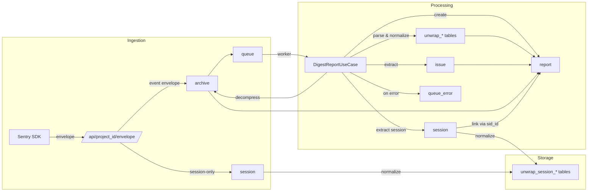

# Database Schema

## Entity Relationship Diagram

```mermaid
erDiagram
    %% ============================================
    %% CORE TABLES
    %% ============================================
    
    project {
        INTEGER id PK
        TEXT public_key UK
        TEXT name
        TIMESTAMP created_at
    }
    
    archive {
        TEXT hash PK
        INTEGER project_id FK
        BLOB compressed_payload
        INTEGER original_size "NULL if received compressed"
        TIMESTAMP created_at
    }
    
    queue {
        INTEGER id PK
        TEXT archive_hash FK,UK
        TIMESTAMP created_at
    }
    
    queue_error {
        INTEGER id PK
        TEXT archive_hash FK,UK
        TEXT error
        TIMESTAMP created_at
    }
    
    %% ============================================
    %% SESSION TABLES
    %% ============================================
    
    unwrap_session_status {
        INTEGER id PK
        TEXT value UK
    }
    
    unwrap_session_release {
        INTEGER id PK
        TEXT value UK
    }
    
    unwrap_session_environment {
        INTEGER id PK
        TEXT value UK
    }
    
    session {
        INTEGER id PK
        INTEGER project_id FK
        TEXT sid UK
        INTEGER init
        TEXT started_at
        TEXT timestamp
        INTEGER errors
        INTEGER status_id FK
        INTEGER release_id FK
        INTEGER environment_id FK
    }
    
    %% ============================================
    %% UNWRAP TABLES
    %% ============================================
    
    unwrap_platform {
        INTEGER id PK
        TEXT value UK
    }
    
    unwrap_environment {
        INTEGER id PK
        TEXT value UK
    }
    
    unwrap_os_name {
        INTEGER id PK
        TEXT value UK
    }
    
    unwrap_os_version {
        INTEGER id PK
        TEXT value UK
    }
    
    unwrap_manufacturer {
        INTEGER id PK
        TEXT value UK
    }
    
    unwrap_brand {
        INTEGER id PK
        TEXT value UK
    }
    
    unwrap_model {
        INTEGER id PK
        TEXT value UK
    }
    
    unwrap_chipset {
        INTEGER id PK
        TEXT value UK
    }
    
    unwrap_locale_code {
        INTEGER id PK
        TEXT value UK
    }
    
    unwrap_timezone {
        INTEGER id PK
        TEXT value UK
    }
    
    unwrap_connection_type {
        INTEGER id PK
        TEXT value UK
    }
    
    unwrap_orientation {
        INTEGER id PK
        TEXT value UK
    }
    
    unwrap_app_name {
        INTEGER id PK
        TEXT value UK
    }
    
    unwrap_app_version {
        INTEGER id PK
        TEXT value UK
    }
    
    unwrap_app_build {
        INTEGER id PK
        TEXT value UK
    }
    
    unwrap_user {
        INTEGER id PK
        TEXT value UK
    }
    
    unwrap_exception_type {
        INTEGER id PK
        TEXT value UK
    }
    
    unwrap_device_specs {
        INTEGER id PK
        INTEGER screen_width
        INTEGER screen_height
        REAL screen_density
        INTEGER screen_dpi
        INTEGER processor_count
        INTEGER memory_size
        TEXT archs
    }
    
    unwrap_exception_message {
        INTEGER id PK
        TEXT hash UK
        TEXT value
    }
    
    unwrap_stacktrace {
        INTEGER id PK
        TEXT hash UK
        TEXT fingerprint_hash FK
        BLOB frames_json
    }
    
    %% ============================================
    %% ISSUE TABLE
    %% ============================================
    
    issue {
        INTEGER id PK
        TEXT fingerprint_hash UK
        INTEGER exception_type_id FK
        TEXT title
        TIMESTAMP first_seen
        TIMESTAMP last_seen
        INTEGER event_count
    }
    
    %% ============================================
    %% MAIN REPORT TABLE
    %% ============================================
    
    report {
        INTEGER id PK
        TEXT event_id UK
        TEXT archive_hash FK
        INTEGER timestamp
        TIMESTAMP received_at
        INTEGER project_id FK
        INTEGER platform_id FK
        INTEGER environment_id FK
        INTEGER os_name_id FK
        INTEGER os_version_id FK
        INTEGER manufacturer_id FK
        INTEGER brand_id FK
        INTEGER model_id FK
        INTEGER chipset_id FK
        INTEGER device_specs_id FK
        INTEGER locale_code_id FK
        INTEGER timezone_id FK
        INTEGER connection_type_id FK
        INTEGER orientation_id FK
        INTEGER app_name_id FK
        INTEGER app_version_id FK
        INTEGER app_build_id FK
        INTEGER user_id FK
        INTEGER exception_type_id FK
        INTEGER exception_message_id FK
        INTEGER stacktrace_id FK
        INTEGER issue_id FK
        INTEGER session_id FK
    }
    
    %% ============================================
    %% RELATIONSHIPS
    %% ============================================
    
    archive ||--o{ queue : "queued for"
    archive ||--o{ queue_error : "failed"
    archive ||--o{ report : "stored in"
    
    project ||--o{ archive : "receives"
    project ||--o{ report : "owns"
    
    unwrap_platform ||--o{ report : "platform"
    unwrap_environment ||--o{ report : "environment"
    unwrap_os_name ||--o{ report : "os_name"
    unwrap_os_version ||--o{ report : "os_version"
    unwrap_manufacturer ||--o{ report : "manufacturer"
    unwrap_brand ||--o{ report : "brand"
    unwrap_model ||--o{ report : "model"
    unwrap_chipset ||--o{ report : "chipset"
    unwrap_locale_code ||--o{ report : "locale"
    unwrap_timezone ||--o{ report : "timezone"
    unwrap_connection_type ||--o{ report : "connection"
    unwrap_orientation ||--o{ report : "orientation"
    unwrap_app_name ||--o{ report : "app_name"
    unwrap_app_version ||--o{ report : "app_version"
    unwrap_app_build ||--o{ report : "app_build"
    unwrap_user ||--o{ report : "user"
    unwrap_exception_type ||--o{ report : "exception_type"
    unwrap_exception_type ||--o{ issue : "exception_type"
    
    unwrap_device_specs ||--o{ report : "device_specs"
    unwrap_exception_message ||--o{ report : "exception_msg"
    unwrap_stacktrace ||--o{ report : "stacktrace"
    issue ||--o{ report : "issue"
    
    project ||--o{ session : "tracks"
    session ||--o{ report : "session"
    unwrap_session_status ||--o{ session : "status"
    unwrap_session_release ||--o{ session : "release"
    unwrap_session_environment ||--o{ session : "environment"
```

## Table Summary

| Category | Tables | Purpose |
|----------|--------|---------|
| **Core** | `project`, `archive`, `queue`, `queue_error` | Project config, raw storage, async processing |
| **Session** | `session`, `unwrap_session_*` | User session tracking and health metrics |
| **Unwrap** | 20 `unwrap_*` tables | Deduplicated string values (normalized) |
| **Issue** | `issue` | Error grouping by fingerprint |
| **Main** | `report` | Central table with 22 FK references |

## Data Flow

**Note:** Sessions in event envelopes are processed during digest (not ingest), ensuring atomic processing of related data.

## Indexes

| Index | Table | Column(s) | Purpose |
|-------|-------|-----------|---------|
| `idx_archive_project` | archive | project_id | Filter archives by project |
| `idx_report_project` | report | project_id | Filter by project |
| `idx_report_timestamp` | report | timestamp | Time-based queries |
| `idx_report_issue` | report | issue_id | Group by issue |
| `idx_report_user` | report | user_id | Filter by user |
| `idx_unwrap_stacktrace_fingerprint` | unwrap_stacktrace | fingerprint_hash | Find stacktraces by fingerprint |
| `idx_session_project` | session | project_id | Filter sessions by project |
| `idx_session_status` | session | status_id | Filter sessions by status |
| `idx_session_sid` | session | sid | Find session by sid |
| `idx_report_session` | report | session_id | Find reports by session |
